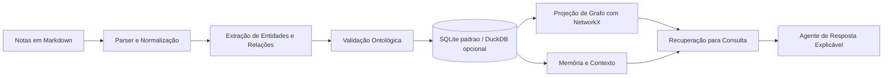
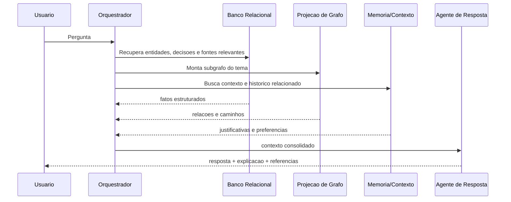

# Arquitetura MVP

## Objetivo da arquitetura

Construir um pipeline local, simples e auditável para transformar notas em conhecimento estruturado e respostas explicáveis. O MVP prioriza rastreabilidade sobre sofisticação algorítmica.

## Componentes principais

1. `Camada de captura`: recebe notas Markdown, links e registros manuais.
2. `Parser e normalização`: extrai metadados, trechos e candidatos semânticos.
3. `Camada ontológica`: valida tipos, relações e regras mínimas.
4. `Persistência`: armazena fontes, entidades, relações, decisões e memória em SQLite como padrão do MVP, mantendo compatibilidade com DuckDB como alternativa.
5. `Projeção de grafo`: monta subgrafos em NetworkX para travessia e análise.
6. `Camada de contexto`: conecta fatos a decisões, objetivos, riscos e alternativas.
7. `Orquestração de consulta`: transforma perguntas em recuperação + síntese explicável.

## Fluxo macro

## Visão por responsabilidade

### 1. Entrada canônica

`Markdown` é a forma de entrada preferida porque é simples, local, versionável e compatível com diversas ferramentas de notas.

### 2. Extração semântica

A extração pode combinar heurísticas e LLM:

- heurísticas para títulos, tags, datas, links e padrões recorrentes;
- LLM para sugerir entidades, relações, hipóteses e resumos;
- revisão por regras para impedir gravação automática de estruturas inválidas.

### 3. Persistência principal

`SQLite` armazena a verdade operacional padrão do MVP. `DuckDB` permanece como alternativa quando houver necessidade predominante de análise local em lote.

- são simples de operar;
- permitem auditoria por SQL;
- reduzem atrito de setup;
- adiam a adoção de um grafo dedicado até haver pressão real.

### 4. Projeção de grafo

O grafo não precisa ser o banco primário no início. Ele pode ser materializado a partir das tabelas relacionais para:

- explorar vizinhança de conceitos;
- localizar caminhos entre entidades;
- calcular centralidade simples;
- montar subgrafos para consulta explicável.

### 5. Contexto e memória

Fatos estruturados sozinhos não bastam. O sistema também armazena:

- decisões anteriores;
- justificativas;
- objetivos ativos;
- riscos conhecidos;
- preferências do usuário;
- histórico de revisão.

## Sequência de uma consulta

## Decisões arquiteturais centrais

- `Banco relacional primeiro, banco de grafo depois`: reduz custo cognitivo e operacional.
- `LLM como assistente, não como fonte da verdade`: fatos persistidos precisam referência de origem.
- `Ontologia leve e versionada`: suficiente para guiar a extração sem travar evolução.
- `Compartimentos como filtro contextual`: ajudam relevância sem impedir conexões interdomínio.

## Riscos e mitigação

| Risco | Impacto | Mitigação |
| --- | --- | --- |
| extração semântica inconsistente | grafo ruidoso | regras de validação, revisão manual e score de confiança |
| modelo inicial genérico demais | respostas vagas | fortalecer ontologia de decisões, riscos e objetivos |
| dependência precoce do LLM | baixa auditabilidade | persistir evidências e separar dado de interpretação |
| crescimento do volume relacional | consultas lentas ou complexas | materializar subgrafos e preparar caminho para Neo4j |

## Evolução prevista

Quando o MVP provar utilidade, a arquitetura pode evoluir para:

- `Neo4j` para exploração relacional avançada;
- `TypeDB` se a ontologia exigir regras mais ricas;
- múltiplos agentes especializados;
- indexação vetorial complementar para busca semântica textual.
