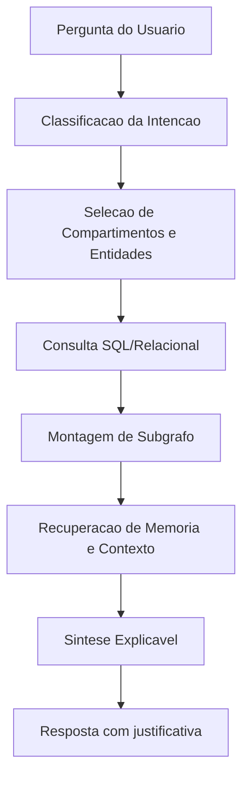

# Fluxo de Consulta

## Objetivo

Converter uma pergunta em resposta explicável, rastreável e coerente com a memória e o contexto do projeto. O sistema não deve apenas “responder bem”; deve mostrar de onde a resposta veio.

## Tipos de pergunta esperados

- recuperação factual: `o que eu já defini sobre X?`
- relação conceitual: `como X se conecta com Y?`
- análise de decisão: `qual opção parece mais coerente agora?`
- revisão histórica: `por que escolhi isso antes?`
- lacunas: `o que ainda está indefinido neste tema?`

## Pipeline de consulta

### 1. Interpretação da pergunta

O orquestrador classifica a intenção:

- busca factual;
- comparação;
- explicação;
- análise de risco;
- sugestão de próximos passos.

Essa classificação define quais dados recuperar.

### 2. Seleção de escopo

O sistema define:

- compartimentos relevantes;
- horizonte temporal;
- entidades prováveis;
- decisões e objetivos relacionados.

### 3. Recuperação estruturada

Busca no banco relacional por:

- entidades relevantes;
- relações conectadas;
- decisões anteriores;
- evidências, riscos e alternativas;
- fontes originais.

### 4. Montagem do subgrafo

Com os resultados, o sistema monta um subgrafo de consulta contendo:

- nós centrais da pergunta;
- vizinhança semântica;
- decisões correlatas;
- relações de suporte e contradição.

### 5. Recuperação de contexto e memória

Entram aqui:

- memória semântica consolidada;
- memória episódica recente;
- preferências do usuário;
- histórico de decisões parecidas.

### 6. Síntese explicável

O agente de resposta deve produzir:

- conclusão principal;
- fatores pró e contra;
- lacunas ou incertezas;
- referências às fontes e decisões usadas.

## Diagrama de fluxo

## Estrutura da resposta esperada

Uma boa resposta no MVP deve ter, quando aplicável:

1. `Resposta curta`: conclusão em uma ou duas frases.
2. `Base da resposta`: fatos, decisões e relações relevantes.
3. `Contexto`: objetivos, restrições e riscos associados.
4. `Incertezas`: pontos pendentes, hipóteses ou conflito de evidências.
5. `Próximo passo`: sugestão operacional.

## Exemplo

Pergunta:

> Vale manter SQLite no MVP?

Resposta esperada:

- `Conclusão`: sim, para o estágio atual.
- `Justificativa`: menor complexidade operacional e alinhamento com foco em validação rápida.
- `Risco`: pode limitar consultas relacionais avançadas.
- `Condição de revisão`: reavaliar quando o volume e a complexidade do grafo crescerem.

## Regra central

Se a resposta não conseguir apontar quais fontes, decisões ou relações a sustentam, ela não está pronta para ser apresentada como resposta confiável do sistema.
