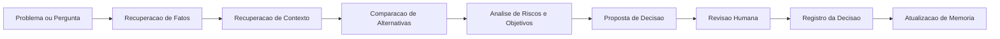

# Agentes e Decisões

## Objetivo

Definir quais agentes fazem sentido no ecossistema do Brain4me e como eles participam do ciclo de decisão sem substituir a governança semântica do sistema.

## Princípio geral

Agentes são operadores sobre conhecimento estruturado. Eles não devem escrever fatos arbitrários no sistema sem referência, validação e contexto.

## Tipos de agentes do MVP

### 1. Agente de ingestão

Responsável por:

- interpretar nota recebida;
- sugerir entidades e relações;
- classificar trechos como fato, hipótese, decisão ou evidência;
- encaminhar itens duvidosos para revisão.

### 2. Agente curador de ontologia

Responsável por:

- verificar aderência aos tipos e relações permitidos;
- detectar duplicidades e aliases;
- sugerir especializações futuras da ontologia;
- impedir degradação do vocabulário semântico.

### 3. Agente de consulta

Responsável por:

- interpretar a intenção da pergunta;
- solicitar fatos, memória e contexto;
- montar resposta explicável com referências.

### 4. Agente de análise de decisão

Responsável por:

- comparar alternativas;
- mapear prós, contras, riscos e oportunidades;
- verificar coerência com objetivos ativos;
- apontar lacunas de evidência.

### 5. Agente auditor

Responsável por:

- detectar contradições;
- localizar decisões sem justificativa;
- sinalizar memória obsoleta;
- revisar consistência entre ontologia, dados e respostas.

## Papel do humano

O sistema é um segundo cérebro, não um substituto de julgamento. O usuário continua responsável por:

- aprovar decisões relevantes;
- revisar inferências ambíguas;
- promover regras permanentes;
- ajustar compartimentos e ontologia.

## Ciclo de decisão sugerido

## Estrutura mínima de uma decisão

Toda decisão relevante deveria registrar:

- problema;
- alternativas consideradas;
- opção escolhida;
- motivos;
- riscos;
- critérios usados;
- condição futura de revisão.

## Limites do MVP

- não criar sistema autônomo multiagente complexo logo de início;
- não permitir que um agente grave verdades permanentes sem fonte;
- não esconder incerteza sob respostas excessivamente confiantes.

## Evolução possível

Após o MVP, os agentes podem ganhar:

- especialização por compartimento;
- memória própria supervisionada;
- avaliação automática de conflito entre fontes;
- workflows de revisão semi-automática.
