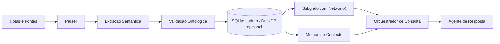
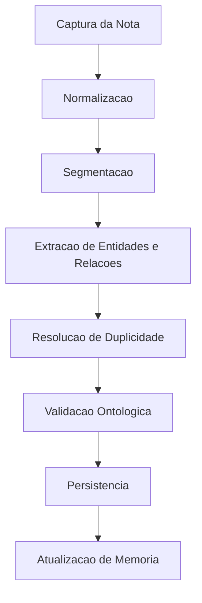
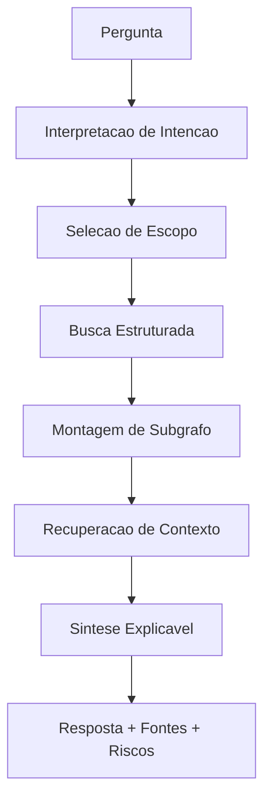

# Diagramas

## Visão sistêmica do MVP

## Fluxo de ingestão

## Fluxo de consulta explicável

## Trade-offs resumidos

| Tema | Escolha atual | Benefício | Custo |
| --- | --- | --- | --- |
| entrada | Markdown | simples, portátil e versionável | semântica precisa ser extraída |
| persistência | SQLite padrão / DuckDB opcional | baixa complexidade operacional | grafo nativo ausente |
| grafo | NetworkX derivado | rápido para protótipo | sem persistência dedicada |
| inteligência | LLM assistivo | acelera extração e síntese | exige validação contra alucinação |
